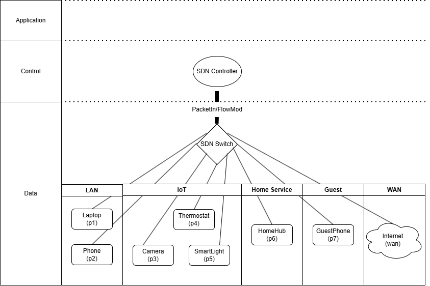

# Smart Home SDN Traffic Control and Audit Logging

A Python-based smart home network simulation that models SDN-style traffic control, IoT message generation, QoS prioritisation, and tamper-evident audit logging.

The project simulates how a controller and switch could manage traffic from smart home devices such as cameras, thermostats, and guest devices, while applying isolation policies and recording packet decisions into a simple blockchain-style audit ledger.

## Topology

## Project Overview

This project was built to explore how software-defined networking concepts could be applied to a smart home environment.

The system simulates:
- an SDN controller
- an SDN switch
- different device groups such as LAN, IoT, home service, guest, and WAN
- packet processing based on flow rules
- IoT-generated telemetry and alarm traffic
- an audit trail for traffic decisions

The overall goal was to combine networking logic, traffic classification, and auditability in one project rather than treating them as separate exercises.

## Main Features

- SDN-style separation between controller logic and switch forwarding behaviour
- Simulated IoT traffic generation using:
  - periodic telemetry
  - event-based alarm bursts
- Policy-based traffic handling for:
  - IoT isolation
  - guest isolation
- QoS-style traffic priority assignment
- Audit records stored in a blockchain-style chain
- Chain validation and tamper testing
- Basic delay evaluation comparing alarm traffic against regular IoT traffic

## Network Zones

The simulated smart home topology is divided into the following groups:

- **LAN** — laptop, phone
- **IoT** — camera, thermostat, smart light
- **Home Service** — home hub
- **Guest** — guest phone
- **WAN** — internet

This structure allows the controller to apply different forwarding or drop decisions depending on the source, destination, and traffic type.

## How It Works

### 1. IoT Message Generation
The project generates:
- **periodic telemetry** from devices such as the thermostat and camera
- **event-driven alarm bursts** from the camera when motion is detected

These messages are converted into packets and sent through the simulated switch.

### 2. Packet Processing
Packets are matched against existing flow rules in the switch.

- If a rule already exists, the packet follows that action
- If no rule matches, the packet is sent to the controller
- The controller evaluates the packet, creates a rule, and installs it into the switch

### 3. Policy Enforcement
The controller applies network policies such as:
- allowing IoT devices to communicate with the HomeHub
- blocking IoT-to-IoT communication where appropriate
- allowing guest traffic only toward the internet
- dropping guest traffic aimed at internal devices

### 4. QoS Prioritisation
Traffic is assigned different priority levels depending on its tag.

For example:
- **ALARM** traffic receives a higher priority
- regular **IOT** telemetry receives a lower priority

This lets the project simulate how urgent traffic can be favoured over routine traffic.

### 5. Audit Logging
Each packet decision is converted into an audit record and added to a blockchain-style ledger.

The chain can then be:
- validated in its normal state
- tampered with deliberately
- validated again to show the integrity failure

## Example Output

The sample output shows:
- generated telemetry and alarm messages
- average delay comparison between alarm and IoT traffic
- successful chain validation before tampering
- failed validation after modifying a stored record

This gives the project both a functional simulation side and a simple verification side.

## Technologies / Concepts Used

- Python
- Dataclasses
- Enums
- Rule-based packet matching
- SDN-style controller/switch interaction
- IoT traffic simulation
- QoS prioritisation
- Blockchain-style audit logging
- Basic performance evaluation

## Repository Contents

- `sdn_smart_home.py` — main simulation code
- `SmartHomeTopology.png` — topology / architecture diagram
- `sample_output.txt` — sample run output
- `test_code_bank.py` — scratch/test code used during development
- `README.md` — project overview

## What This Project Demonstrates

This project demonstrates:
- network and systems thinking
- rule-based traffic control
- separation of control logic and forwarding logic
- simulation of different traffic types and behaviours
- security-oriented thinking through isolation policies
- auditability through tamper-evident logging
- the ability to evaluate system behaviour rather than only build it

## What I Learned

This project helped me practice combining networking and software concepts in one system.

Instead of only building a basic packet simulation, I wanted to model:
- how traffic policies are applied,
- how different traffic classes can be prioritised,
- and how packet decisions could be logged in a way that supports integrity checking.

It also made me think more carefully about how to structure interacting components like packets, rules, controller decisions, and audit records.

## Future Improvements

Some next steps I would take on this project:
- implement an operational rate-limiting feature
- add idle timeout handling for flow rules
- expand the simulation with more device types and traffic classes

## Summary

This project was built to show how SDN-style traffic control concepts could be applied to a smart home environment using Python. It combines packet processing, IoT message simulation, QoS prioritisation, and audit logging into one system-focused project.
